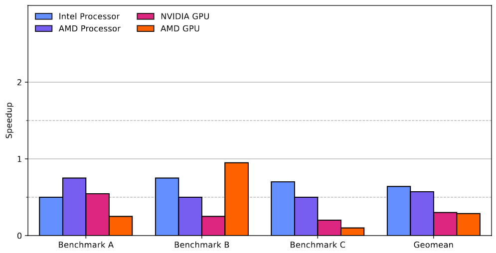

# Plot: Bar Chart with Clusters

## Description

Generates a bar chart where the series are clustered by category.

Provides an alternative, simplified way to use the library though a easier-to-generate `data.cluster.json` file.

## How to use it (and run the example)

`python gen_bar_chart [--palette] [--geomean] <data.cluster.json> <template.json>`

- `--palette`: to specify the color palette to use.
- `--geomean`: if present, the script will calculate the geometric mean of each series and add a new cluster with the name `Geomean`.
- `example/data.cluster.json` is the data file with the series and categories.
- `template.json`: base template following the library format. Some fields will be automatically filled by the script (look at the example).

Run with `--help` for further information.
